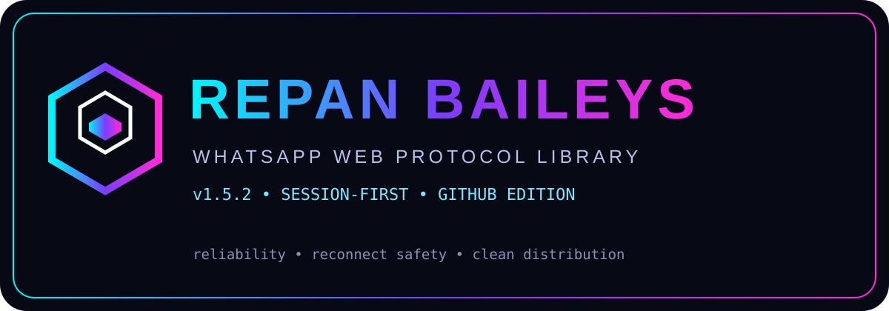

<div align="center">



# `@repanxtenka/baileys`

### A session-first WhatsApp Web protocol library for Node.js

[](https://github.com/RepannnOffcl/BailsAing)
[](https://github.com/RepannnOffcl/BailsAing)
[](https://nodejs.org/)
[](LICENSE)

**Repan Baileys** is a community-maintained Baileys-derived WhatsApp Web protocol library focused on persistent authentication, reconnect-safe sessions, message normalization, pairing-code support, terminal QR support, rate-aware sending, and clean GitHub distribution.

> **Notice:** This project is not affiliated with, endorsed by, or sponsored by WhatsApp or Meta Platforms.

</div>

---

## ✦ Overview

`@repanxtenka/baileys` is a Node.js library for applications that communicate with WhatsApp Web-compatible protocol endpoints.

The engineering focus is not only “connect once and send a message”. A real bot has to survive reconnects, temporary network failures, authentication updates, message bursts, process restarts, duplicate initialization, filesystem races, and evolving message structures.

This edition therefore emphasizes:

- persistent authentication
- single-owner auth locking
- reconnect-safe lifecycle handling
- QR and pairing-code login
- atomic credential persistence
- message-content normalization
- rate-aware scheduling
- session/crypto consistency
- ESM import integrity
- GitHub-first installation
- repeatable release QA

> **Core idea:** a WhatsApp connection is a long-lived session, not a one-shot WebSocket.

---

## ⚡ Quick start

### Install directly from GitHub

```bash
npm install github:RepannnOffcl/BailsAing#main
```

Or in `package.json`:

```json
{
  "dependencies": {
    "@repanxtenka/baileys": "github:RepannnOffcl/BailsAing#main"
  }
}
```

Then:

```bash
npm install
npm ls @repanxtenka/baileys
```

Expected:

```text
@repanxtenka/baileys@1.5.2
```

The current release line is **GitHub-first**. Do not put `"1.5.2"` as an npm registry dependency until that exact version has actually been published to npm.

---

## 🧬 Project identity

| Property | Value |
|---|---|
| Package | `@repanxtenka/baileys` |
| Version | `1.5.2` |
| Source | `RepannnOffcl/BailsAing` |
| Branch | `main` |
| Runtime | Node.js |
| Module system | ESM |
| Target | Linux / Termux / VPS |
| Protocol | WhatsApp Web compatible |
| Official Meta API | No |
| Official WhatsApp project | No |

---

## 🧩 Public-bot identity without breaking connectivity

This library is designed to be shared publicly. **Bot branding and WhatsApp protocol identity are intentionally separated.**

Every developer can give their own application a different name:

```js
const sock = makeWASocket({
  botName: 'My Bot',
  authDir: './session/my-bot'
})
```

`botName` is application metadata for your own UI/logging. It is **not** injected into the WhatsApp companion/browser identity by default.

For protocol compatibility, the default connection profile is deliberately canonical:

```js
browser: ['Ubuntu', 'Chrome', '1.0']
safePairingIdentity: true
```

This separation matters. Current WhatsApp Web compatibility has been sensitive to live Web version freshness, custom browser labels, and legacy Desktop sub-platform descriptors. The public default therefore keeps a canonical web-browser identity while allowing every bot to use its own branding in its own application layer.

Relevant upstream reports:

- https://github.com/WhiskeySockets/Baileys/issues/2679 — stale WA Web version can block login/pairing.
- https://github.com/WhiskeySockets/Baileys/issues/2560 — non-canonical browser labels can produce dead pairing codes.
- https://github.com/WhiskeySockets/Baileys/issues/2677 — legacy Desktop web-sub-platform descriptors can be rejected while WEB_BROWSER works.

When pairing, the library uses the safe canonical companion identity by default even when your application has a custom `botName`.

Advanced protocol experiments can explicitly opt out:

```js
safePairingIdentity: false
```

That setting is for compatibility testing. A custom browser identity can reduce pairing compatibility with WhatsApp.

---

## 🧰 Requirements

Recommended:

```text
Node.js 20+
npm 9+
Linux / Termux / VPS
Internet connection
WhatsApp account for device linking
```

Check:

```bash
node -v
npm -v
```

---

## 🏁 Minimal example

```js
import makeWASocket, {
  useMultiFileAuthState,
  DisconnectReason
} from '@repanxtenka/baileys'

const { state, saveCreds } =
  await useMultiFileAuthState('./session')

const sock = makeWASocket({
  auth: state,
  printQRInTerminal: true
})

sock.ev.on('creds.update', saveCreds)

sock.ev.on('connection.update', ({ connection, lastDisconnect }) => {
  console.log('[connection]', connection)

  if (connection === 'close') {
    const code = lastDisconnect?.error?.output?.statusCode

    if (code !== DisconnectReason.loggedOut) {
      console.log('[reconnect] connection closed; restart your controlled lifecycle')
    }
  }

  if (connection === 'open') {
    console.log('[connected] WhatsApp session is ready.')
  }
})
```

Run:

```bash
node index.js
```

---

# 🔐 Authentication & sessions

Authentication state is the heart of a long-running WhatsApp client.

Recommended:

```js
const { state, saveCreds } =
  await useMultiFileAuthState('./session')
```

Then:

```js
sock.ev.on('creds.update', saveCreds)
```

Typical layout:

```text
your-bot/
├── index.js
├── package.json
├── node_modules/
└── session/
    ├── creds.json
    ├── app-state-sync-*.json
    ├── pre-key-*.json
    └── sender-key-*.json
```

### Never publish `session/`

Add:

```gitignore
node_modules/
session/
auth/
.env
*.log
```

Never commit:

```text
creds.json
pre-key files
sender-key files
private tokens
API keys
```

---

# 🔒 Auth locking

One common failure in bot projects is opening the same auth directory multiple times from one live process.

Bad lifecycle:

```text
connect()
   ↓
reconnect()
   ↓
useMultiFileAuthState() again
   ↓
session collision
```

The intended model is:

```text
Process
  │
  └── owns session/
       ├── connect
       ├── reconnect
       └── persist
```

For multiple independent processes, use separate session directories.

If you see:

```text
BAILEYS_AUTH_LOCKED
```

first check for duplicate Node processes:

```bash
ps -A | grep node
```

Do not immediately delete a valid session.

---

# 📱 Pairing code

Pairing code is useful when terminal QR scanning is inconvenient.

Conceptual flow:

```text
Bot start
   ↓
Transport ready
   ↓
Normalize phone number
   ↓
Request pairing code
   ↓
Enter code in WhatsApp
   ↓
Credentials update
   ↓
Persist session
   ↓
Reconnect/open
```

Example:

```js
const code = await sock.requestPairingCode(phoneNumber)
console.log('PAIRING CODE:', code)
```

Use international digits:

```text
628xxxxxxxxxx
```

rather than:

```text
08xxxxxxxxxx
```

The exact pairing lifecycle can depend on current WhatsApp server behavior, so applications should treat pairing as an asynchronous connection state.

---

# 🖥️ QR login

Terminal QR remains supported for normal device linking.

```js
const sock = makeWASocket({
  auth: state,
  printQRInTerminal: true
})
```

The QR itself is generated by the application/terminal layer. Keep the terminal unobstructed while linking.

---

# 🔄 Reconnect lifecycle

Temporary connection closure is not necessarily a permanent failure.

A useful distinction is:

```text
temporary close
      ↓
controlled reconnect
```

versus:

```text
logged out
      ↓
new authentication required
```

Example:

```js
if (connection === 'close') {
  const statusCode =
    lastDisconnect?.error?.output?.statusCode

  if (statusCode !== DisconnectReason.loggedOut) {
    // reconnect using your single-flight lifecycle
  }
}
```

Do not allow several reconnect routines to create several sockets at the same time.

A robust application treats reconnect as a normal state transition:

```text
OPEN
 ↓
CLOSED
 ↓
RECONNECTING
 ↓
OPEN
```

---

# 🧠 Message normalization

WhatsApp messages can be wrapped:

```text
Message
 └── ephemeralMessage
      └── viewOnceMessage
           └── imageMessage
```

Do not assume the first object layer is the final content.

The library provides content extraction/normalization primitives intended to simplify handling of nested message structures.

Common families include:

```text
conversation
extendedTextMessage
imageMessage
videoMessage
audioMessage
documentMessage
stickerMessage
contactMessage
contactsArrayMessage
locationMessage
liveLocationMessage
reactionMessage
pollCreationMessage
pollUpdateMessage
interactive/native-flow messages
view-once wrappers
ephemeral wrappers
protocol messages
edited-message structures
```

WhatsApp's protocol evolves continuously. Applications should still test the exact message types they depend on.

---

# 📨 Message events

Typical handler:

```js
sock.ev.on('messages.upsert', ({ messages, type }) => {
  for (const message of messages) {
    if (!message?.message) continue

    console.log({
      type,
      id: message.key?.id,
      remoteJid: message.key?.remoteJid
    })
  }
})
```

Production applications should account for:

- duplicate delivery
- history synchronization
- message updates
- protocol messages
- deleted/revoked content
- missing metadata
- nested wrappers
- partial payloads

---

# 📤 Sending messages

Text example:

```js
await sock.sendMessage(jid, {
  text: 'Hello from Repan Baileys'
})
```

The available payload structures depend on the message type supported by the protocol layer.

Always validate user-controlled input before turning it into outgoing message content.

---

# ⏱️ Rate-aware sending

High-volume automation should use controlled scheduling instead of firing every operation immediately.

Conceptually:

```text
Message A ─┐
Message B ─┼──► Queue ──► Scheduler ──► Transport
Message C ─┤
Message D ─┘
```

This is safer than:

```js
send()
send()
send()
send()
send()
```

The rate limiter also guards against negative-delay calculations caused by overlapping cooldown/deadline calculations.

> Rate limiting is not permission to spam. Use automation only for legitimate, authorized use and respect platform rules and recipient consent.

---

# 🧩 Architecture

Simplified source layout:

```text
src/
├── index.js
├── auth/
│   ├── state.js
│   └── file-store.js
├── socket/
├── messages/
├── signal/
├── crypto/
├── protocol/
├── transport/
└── compat/
    └── baileys.js
```

Conceptual dependency flow:

```text
Application
    │
    ▼
Public API
    │
    ├── Socket lifecycle
    ├── Authentication
    ├── Message normalization
    ├── Protocol
    ├── Crypto/session state
    └── Transport
```

---

# 🧪 QA & release engineering

A source tree can pass tests while the final package is broken.

For example, if `src/index.js` imports:

```text
src/auth/state.js
```

but the release archive accidentally omits that file, the source repository may look fine while consumers receive:

```text
ERR_MODULE_NOT_FOUND
```

Therefore this project checks the **actual distribution tree**, not just the development tree.

The prepared 1.5.2 release was validated with:

```text
Sequential test suite       109/109 PASS
Parallel test suite         109/109 PASS
Local import graph          0 missing imports
Release audit               PASS
Package check               PASS
Packaging check             PASS
Sensitive-file scan         PASS
```

These are release-artifact QA results, not a promise that future upstream WhatsApp protocol changes cannot introduce new compatibility issues.

---

# 🔬 Development commands

Clone:

```bash
git clone https://github.com/RepannnOffcl/BailsAing.git
cd BailsAing
```

Install:

```bash
npm install
```

Test:

```bash
npm test
```

Audit:

```bash
npm run audit
```

Release validation:

```bash
npm run release:check
```

Package validation:

```bash
npm run pack:check
```

Dry-run package inspection:

```bash
npm pack --dry-run
```

---

# 🧯 Troubleshooting

## `ERR_MODULE_NOT_FOUND`

Example:

```text
Cannot find module
.../node_modules/@repanxtenka/baileys/src/auth/state.js
```

Check:

```bash
npm ls @repanxtenka/baileys
ls node_modules/@repanxtenka/baileys/src/auth/
```

Then perform a clean installation:

```bash
rm -rf node_modules package-lock.json
npm install github:RepannnOffcl/BailsAing#main
```

Do not manually patch `node_modules`. If a required source file is absent, repair the repository/package tree.

---

## `E404 @repanxtenka/baileys`

If npm says:

```text
404 Not Found
@repanxtenka/baileys@1.5.2
```

you are asking the npm registry for a version that has not been published there.

Current GitHub-first installation:

```bash
npm install github:RepannnOffcl/BailsAing#main
```

---

## `git-clone.../package.json`

If npm reports:

```text
~/.npm/_cacache/tmp/git-cloneXXXX/package.json
ENOENT
```

verify that `package.json` exists at the repository root.

Correct:

```text
BailsAing/
├── package.json
├── src/
└── README.md
```

Incorrect:

```text
BailsAing/
└── BailsAing/
    ├── package.json
    └── src/
```

---

## `BAILEYS_AUTH_LOCKED`

Check duplicate processes:

```bash
ps -A | grep node
```

Stop the duplicate bot process and restart the intended process.

Do not delete a valid session unless you intentionally want to unlink/re-authenticate.

---

## `bufferutil` / `node-gyp`

Inspect who introduced them:

```bash
npm ls bufferutil utf-8-validate node-gyp
```

Do not automatically blame Baileys. Consumer projects can introduce native dependencies independently.

---

## `sharp`

Check:

```bash
npm ls sharp
```

If `sharp` is compiling through `node-gyp`, it is usually an image-processing dependency elsewhere in the consumer dependency graph, not a protocol requirement.

---

# 🧹 Clean GitHub reinstall

For testing a fresh GitHub revision:

```bash
cd ~/your-bot

rm -rf node_modules
rm -f package-lock.json

npm cache verify

npm install github:RepannnOffcl/BailsAing#main

npm ls @repanxtenka/baileys
```

---

# 📁 Recommended consumer structure

```text
my-bot/
│
├── package.json
├── index.js
├── src/
│   ├── commands/
│   ├── handlers/
│   └── utils/
├── session/
├── assets/
└── logs/
```

Keep session data separate from application source.

---

# 🔐 Security checklist

Before making a bot repository public:

```text
[ ] session/ ignored
[ ] creds.json ignored
[ ] .env ignored
[ ] API keys removed
[ ] private tokens removed
[ ] private keys removed
[ ] logs checked for secrets
[ ] Git history checked
[ ] test accounts/credentials removed
```

Search:

```bash
find . -type f \
  \( -name "creds.json" -o -name ".env" -o -name "*.pem" \) \
  -not -path "./node_modules/*"
```

Check Git:

```bash
git status
```

---

# 🌐 GitHub-first release flow

```text
SOURCE
  │
  ▼
TEST
  │
  ├── unit/integration tests
  ├── import graph
  ├── auth/session checks
  ├── package checks
  └── sensitive-file scan
  │
  ▼
GITHUB main
  │
  ▼
npm install from GitHub
  │
  ▼
consumer smoke test
  │
  ▼
release candidate
  │
  ▼
npm publication
```

The npm release is intentionally a separate step from GitHub development.

---

# 📦 GitHub vs npm

## GitHub

Current:

```bash
npm install github:RepannnOffcl/BailsAing#main
```

Useful for:

- development
- source inspection
- branch testing
- immediate repository updates

## npm

Future stable installation:

```bash
npm install @repanxtenka/baileys
```

Only advertise this after the exact version has been published.

---

# 🧠 Compatibility

WhatsApp Web is a moving protocol environment.

Server-side behavior can change independently from this repository.

Potentially changing areas include:

```text
message schemas
interactive message formats
authentication
device linking
connection lifecycle
server requirements
```

Therefore:

> A library release represents a tested compatibility snapshot, not a permanent guarantee against future upstream protocol changes.

---

# ⚠️ Responsible use

Use this project for legitimate automation, development, testing, and accounts you are authorized to operate.

Do not use it for:

```text
spam
harassment
unauthorized account access
credential theft
malware distribution
impersonation
platform-enforcement evasion
unwanted bulk messaging
```

Protocol access does not remove application-level responsibility.

---

# 🗺️ Roadmap

### Core

- [x] ESM package
- [x] GitHub installation
- [x] Persistent authentication
- [x] Auth locking
- [x] QR flow
- [x] Pairing-code flow
- [x] Reconnect lifecycle
- [x] Message normalization
- [x] Rate-aware scheduling
- [x] Release/package audits

### Reliability

- [x] Atomic credential persistence
- [x] Session consistency checks
- [x] Local import audit
- [x] Sensitive-file scan
- [x] Packaging regression checks
- [x] Concurrent test coverage

### Distribution

- [x] GitHub-first distribution
- [x] Clean package layout
- [x] npm package preparation
- [ ] npm public release
- [ ] stable release channel
- [ ] automated release pipeline

---

# 🧾 Release checklist

Before a release:

```bash
npm test
npm run audit
npm run release:check
npm run pack:check
npm pack --dry-run
```

Inspect:

```bash
git status
git diff
```

Then:

```bash
git add -A
git commit -m "release: 1.5.2"
git push origin main
```

---

# 🤝 Contributing

Good bug reports include:

```text
Node.js version:
OS / Termux version:
Package version:
Git commit:
Exact error:
Minimal reproduction:
Expected behavior:
Actual behavior:
```

For bug fixes:

1. Identify the root cause.
2. Keep unrelated refactors out.
3. Preserve existing public behavior where possible.
4. Add a regression test.
5. Run the full test suite.
6. Run release/package checks.
7. Inspect the final Git tree.
8. Never attach authentication secrets.

---

# 📜 License

See [`LICENSE`](LICENSE).

Keep the applicable license and attribution requirements when redistributing or modifying the project.

---

<div align="center">

## `REPAN BAILEYS // 1.5.2`

`Protocol • Session • Reliability • Distribution`

**Built for developers who would rather debug once than debug the same crash seventeen times.**

</div>
